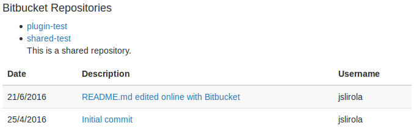

# jquery-bitbucket-tracker

Track your public repositories from Bitbucket.

## Preview



## Install

Via 'pip'

```
npm install jquery-bitbucket-tracker
```

Or [download the files](https://github.com/jslirola/jquery-bitbucket-tracker/archive/master.zip).

## Arguments

```js
    username: "jslirola",       // Account name of Bitbucket
    showDetails: false,         // Details of repository like description
    getCommits: {
        showTable: true,        // When the repo is clicked will show the table
        cssTable: "repoTable",  // Selector to show the events output
        maxRows: 10             // Between 0 and 50 events
    }
```

## Usage

Include jQuery library and the script.

```html
    <script src="https://code.jquery.com/jquery-2.1.4.min.js"></script>
    <script src="bbucketTrack.js"></script>
```

Define a list where your repositories will be show.

```html
    <ul class="repos"></ul>
```

Call the constructor of the class.

```js
    $("ul.repos").bbRepositories({
        username: "jslirola",
        showDetails: true,
        getCommits: {
            cssTable: "table table-striped",
        }
    });
```

## Next updates

* Date format
* Track another events apart from commits
* Custom visibility
* Check private repositories (Require OAuth)